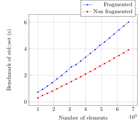
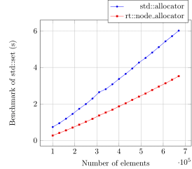
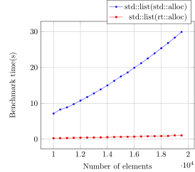

### Node allocators in C++

"Size management adds undue difficulties and inefficiencies to
any allocator design" (Alexandrescu)

**Abstract**: This is a non-breaking proposal to the C++ standard
that aims to reduce allocator complexity, support realtime
allocation and improve memory access patterns on associative
ordered containers. An example implementation is provided
together with benchmarks.

### Table of contents

* [Introduction](#Introduction)
* [Motivation and scope](#Motivation-and-scope)
* [Impact on the Standard](#Impact-on-the-standard)
* [Benchmarks](#Benchmarks)
* [References](#References)

### Introduction

The importance of linked data structures in computer science,
like trees and linked lists, cannot be over-emphasised, yet, in
the last couple of years it has become a common trend in C++ to
move away from such data structures due to their sub-optimal
memory access patterns.  In fact, many people today prefer to use
the flat alternatives and pay O(n) insertion time than O(1) at
the cost of memory fragmentation and unpredictable performance
loss.

On some domains, like **realtime applications**, **embedded
systems** or **systems that aim 24/7 availability**, the
unpredictability introduced by memory fragmentation is simply
unaffordable.

Even though the sub-optimal access patterns are inherent to
linked data structures, we think that a small non-breaking
addition to the C++ allocator model could strongly improve
performance and render them usable even **hard-real-time**
contexts.

The core of the idea is to make ordered associative containers
(std::list, std::forward_list, std::set, std::multiset, std::map
and std::multimap) support allocators that can serve only one size
of memory blocks.  With that support, we could introduce
allocators that use pre-allocated nodes that are linked as a
stack. When an element is inserted in the container the allocator
pops one node from the stack, when an element is removed the
allocator pushes it back into the stack.  Pushing and popping
from a stack are O(1) operations that do not depend
fragmentation or any allocation algorithm.

The allocate and deallocate member functions look like this in
these allocators.

```c++
pointer allocate()
{
  pointer p = m_stack.pop(); 
  if (!p)
    throw std::bad_alloc();
  return p; 
}

void deallocate(pointer p)
{
  m_stack.push(p);
}
```
The alert reader may have noticed, that these functions differ
from their standard definitions by the fact that they do not have
an argument to inform the size to be allocated or deallocated. It
is not possible to allocate more than one consecutive node.

This repository contains an example implementation of these
allocators. For example

```c++
  std::array<char, 2000> buffer = {{}};
  rt::node_allocator<int> alloc(buffer);

  std::list<int, rt::node_allocator<int>> t1(alloc);
  t1 = {5, 3, 7, 20, 1, 44, 22, 8};

  print(t1);
```

In this example the array buffer will serve as arena for all
allocations made by the list t1 i.e. all elements inserted in the
list will be stored in buffer. The size of the memory returned by
::allocate fits exactly what is requested by the list i.e. the
size of its node type, that is known when the list rebinds the
allocator.  This way there is no waste of memory.

### Motivation and scope

Some of the motivations behind node_allocators are:

* Support the most natural and fastest allocation scheme for
  linked data structures. In libstd++ and libc++ for example, it
  is already possible to use this allocation technique, since n
  is always equal to 1 on calls of allocator_type::allocate(n).

* Support hard-realtime allocation for node-based containers.
  This is highly desirable to improve C++ use in embedded
  systems.

* Most allocators found in the literature are overly complicated
  as a result of having to handle blocks of different size. In
  ordered associative containers this is unnecessary since the
  requested memory have always the same size.

* The user should not *have to* provide allocators that
  handle different allocation sizes when containers do not make
  use of this feature. Users pay for a feature that is not used.

* Avoid wasted space behind allocations. It is pretty common that
  allocators allocate more memory than requested to store
  informations like the size of the allocated block.

* Keep nodes in as-compact-as-possible buffers, either on the
  stack or heap, improving cache locality and making them
  specially usefull for embedded programming.

To give the reader a rough idea of how baddly memory
fragmentation can affect performance, I have made benchmarks for
std::list and std::set. The benchmark is made inside of a pure
function, say foo. Since the function is pure, we expect it to
behave the same way, regardless of global state. However, with
fragmentation I noticed I can degrade performance up to one
order of magnitude. For example

```c++
  fragments_heap(); // Comment this for non-fragmented scenario.
  foo(std::list<int>());
```
The following graphs show how the function fragments_heap
influence the performance of foo.

,
,

### Impact on the Standard

This proposal does not require any breaking change. We require
ordered associative containers to support the following
additional allocator overload
```c++
pointer allocate()
void deallocate(pointer p)
```
To do so, it is necessary to add a new member to
```std::allocator_traits``` so that container implementors have means
to know which function has to be used i.e. call allocate(n) or
allocate().

```c++
using use_node_alloc = std::true_type;
```

### Benchmarks

The figures below show the bencharks I have made to compare the
performance of of the rt::node_allocator against the standard
allocator.

  1. `std::allocator`.
  2. `rt::allocator`. (The node allocator.)

The benchmarks are performed on a scenario with a fragmented
heap, where I dynamically allocate many `char`'s on the heap
and leave some holes for the nodes that will be allocated by
the container. 

,
,

As the reader can see, the node allocator was never slower
then the standard allocator.

### References

* [Knuth](The Art of Computer Programming)

